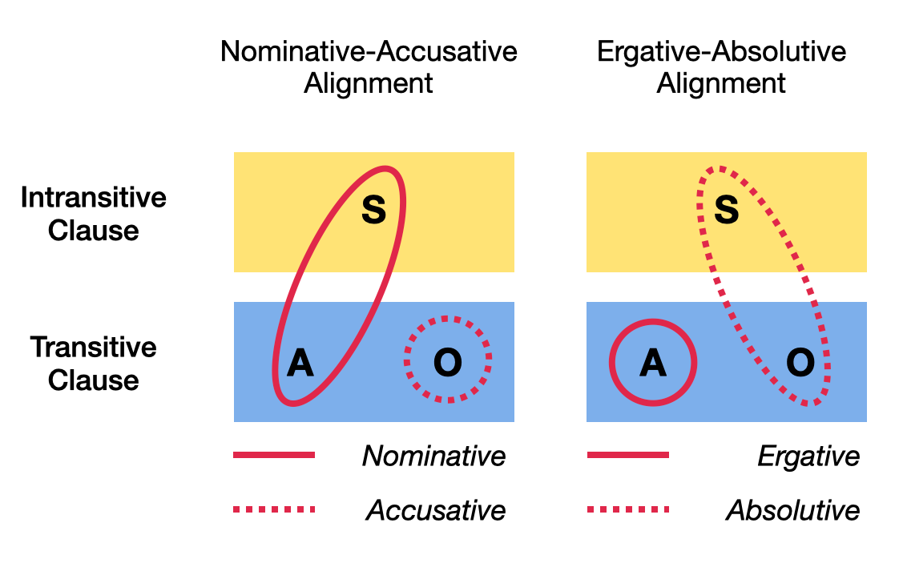
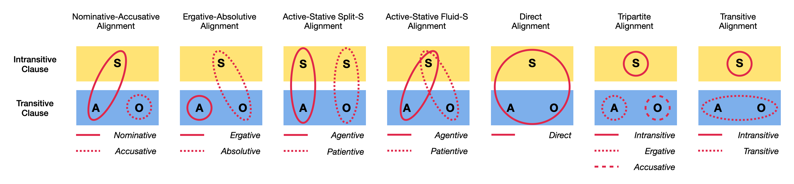

# Herhaling

## Enkele syntaxisgerelateerde termen

* constituenten
* valentie
* head-marking
* dependent-marking

# Verschillen in betekenis van relaties 

## (1) semantische rollen / thematic roles

[(1) Ze gaan de auto herstellen.]{.ex}
<br>[(2) Het is de auto die ze gaan herstellen.]{.ex}
<br>[(3) De auto zal door hen hersteld worden.]{.ex}

::: {.fragment}
Semantische rollen: (1) = (2) = (3)

* [Actor]{.alert2}: doet de actie (*ze*)
* [Undergoer]{.alert2}: ondergaat de actie (*de auto*)
  
:::

## (1) semantische rollen / thematic roles

Belangrijk hierbij is dat je de zin benadert op basis van de betekenis van het ["Event"]{.alert} dat beschreven wordt, niet op basis van grammatica of syntaxis.

→ Hoe vloeit "de energie in het Event"? Welke soorten argumenten zijn daarbij betrokken?

soorten Actors

|  Actors   |    voorbeeld
|-----------|-------------
Agent       |  ***Bill** killed the fly.* (transitief)
Experiencer | ***Susan** heard the song.* (transitief)
Subject     |  ***Kevin** walked to school.*

## (1) semantische rollen / thematic roles


soorten Undergoers

|  Undergoers   |    voorbeeld
|-----------|-------------
Patient | *Bill killed the **fly**.*
Stimulus |  *Susan heard **the song**.*
Theme  | *John gave Mary **a casserole**.*
Recipient  |  *John gave **Mary** a casserole.*


andere rollen

|  andere rollen   |    voorbeeld
|-----------|-------------
Instrument  |  *Bill killed the fly **with the spatula**.*
Location |    *Susan heard the song **in the car**.*
Direction / Goal | *Kevin walked **to school**.*

<!-- ## (1) semantische rollen / thematic roles -->

<!-- Niet altijd mogelijk om de thematische rollen van elkaar te onderscheiden. -->

<!-- [The hammer broke the window.]{.ex} -->

<!-- *hammer* kan hier mogelijks als de volgende semantische rollen bechouwd worden -->

<!-- * Agent -->
<!-- * Instrument -->
<!-- * Force -->
<!-- * ... -->

## (1) semantische rollen / thematic roles

Vaak vallen deze semantische rollen samen met hoe naamvallen / voorzetselconstituenten (PP) werken in verschillende talen

naamval | kernfunctie | "voorzetsel"
--------|------------|-----------
nominatief / ergatief / absolutief | Actor |
accusatief / absolutief | Undergoer |
vocatief | Addressee | (*o*)
datief | Recipient | *aan*, *voor*
genitief | Possessor | *van*
locatief | Location | *in, bij, op*
instrumentalis | Instrument | *met*
ablatief | Point of origin | *uit, vanaf*
allatief | Goal, Direction | *naar, tot, toe*

[Zie ook deze pagina.](https://nl.wikipedia.org/wiki/Naamval){target="_blank"}


## (1) semantische rollen / thematic roles

Dus (herhaling):

[(1) Ze gaan de auto herstellen.]{.ex}
<br>[(2) Het is de auto die ze gaan herstellen.]{.ex}
<br>[(3) De auto zal door hen hersteld worden.]{.ex}


Semantische rollen: (1) = (2) = (3)

* [Actor]{.alert2}: doet de actie (*ze*)
* [Undergoer]{.alert2}: ondergaat de actie (*de auto*)


## (2) informatiestructuur

[(1) Ze gaan de auto herstellen.]{.ex}
<br>[(2) Het is de auto die ze gaan herstellen.]{.ex}
<br>[(3) De auto zal door hen hersteld worden.]{.ex}

::: {.fragment}
Informatiestructuur: (1) ≠ (2) 

Verschil in [focus]{.alert} (de belangrijkste informatie): *de auto* in (2)

Vergelijk (1) vs. (2) in relatie tot deze vragen:

Vraag 1: Wat gaan ze doen?

Vraag 2: Wat gaan ze herstellen?
  
:::

## (3) grammaticale beschrijving / syntactic roles

[(1) Ze gaan de auto herstellen.]{.ex}
<br>[(2) Het is de auto die ze gaan herstellen.]{.ex}
<br>[(3) De auto zal door hen hersteld worden.]{.ex}

::: {.fragment} 
Grammaticale beschrijving (syntactic roles): (1) ≠ (3)

[Subject / Onderwerp]{.alert2}: belangrijkste constituent in de zin

[Object / Voorwerp]{.alert2}: tweede belangrijkste constituent in de zin

Vergelijk  verdergaan in (1): *… en hem daarna  verkopen*  (perspectief = ze)
<br>vs.
<br> verdergaan in (3): *… en  dus  snel  weer  rijklaar  zijn*  (perspectief  = de auto)

:::

## Nuances - conflatie

Hoewel deze drie manieren om naar relaties te kijken principieel verschillen van elkaar, worden ze toch vaak door elkaar gehaald. 

Waarom?

* taalspecifieke overeenkomsten
* theoriespecifieke conventies

Uit zich in subtiele tests, verderzetting van bepaalde (oudere) tradities


## Nuances - mismatch?

```
               Marc        geeft   Jef            het boek.
Structureel    NP                  NP             NP
Semantisch     Agent               Recipient      Theme
Syntactisch    Subject             Object         Object
Traditioneel   Onderwerp           Meewerkend V   Lijdend V


               Marc        geeft   het boek      aan Jef.
Structureel    NP                  NP            PP
Semantisch     Agent               Theme         Recipient    
Syntactisch    Subject             Object        Object (?)        
Traditioneel   Onderwerp           Lijdend V     Meewerkend V 
```

## Nuances - daarom: vereenvoudiging

Concreet, in onze oefeningen, bekijken we het vooral op een eenvoudigere manier.

→ Wie doet? (Actor)
<br>→ Wie  ondergaat ? (Undergoer)
<br>→ Hoe wordt dit gemarkeerd? (head/dependent)


## Alignment

[Morfosyntactisch alignment](https://en.wikipedia.org/wiki/Morphosyntactic_alignment){target="_blank"} = de grammaticale relatie tussen (de twee) argumenten  van een transitief werkwoord vs. (het ene) argument van een intransitief werkwoord.

Interactie tussen valentie en semantische rollen van de argumenten

valentie      |  argumenten  |    voorbeeld
-------------|--------------|-------------
intransitief |  Subject S  |  De man wandelt.
transitief   |  Agent A, Patient P | De man eet groentjes.

→ Hoe gaan talen om met de twee Actor-rollen?
<br> → Valt S samen met A of valt S samen met P?

## Alignment

```{r}
library(glossr)

alig_basa <- as_gloss(
  "Gizona-∅ etorri da.",
  "the.man-ABS come has",
  "S VERB.INTRANS AUX",
  translation = "De man is aangekomen.",
  source = "Baskisch"
)

alig_basb <- as_gloss(
  "Gizona-k mutila-∅ ikusi du.",
  "the.man-ERG boy-ABS seen has",
  "A P VERB.TRANS AUX",
  translation = "De man zag de jongen.",
  source = "Baskisch"
)

alig_basa

alig_basb
```

## Alignment (incursus)




## Aligment (excursus)



## Oefening syntaxis Guugu Yimithirr

We maken deze oefening eerst verder af.


## Oefening syntaxis 

We maken oefening 2 (en 3 indien tijd).


# Tegen volgende week

Herhaal de termen die we vandaag gezien hebben.


