# Oefening

<!-- ## Oefening syntaxis Kiswahili -->

<!-- We maken de oefening eerst verder af. -->

# Syntaxis

## Weergave constituentenstructuur

→ Vaak  gebruikt in sommige  theorieën , niet / minder in andere

Veel types representaties , afhankelijk van:

* theoretisch model
* type taal

Allemaal op de een of andere  manier :

* afbakening  constituenten
* hiërarchie  en  inbedding

## Weergave constituentenstructuur: regels

Representatie met regels:

[Het insect zoemt rond het lege  glas.]{.ex}

* S → NP V PP
*	PP → P NP
*	NP → D (A) N
*	D → het; N → insect , glas; A → lege ; V → zoemt ; P →  rond

## Weergave constituentenstructuur: boomstructuur

Boomstructuur om hiërarchie te visualiseren

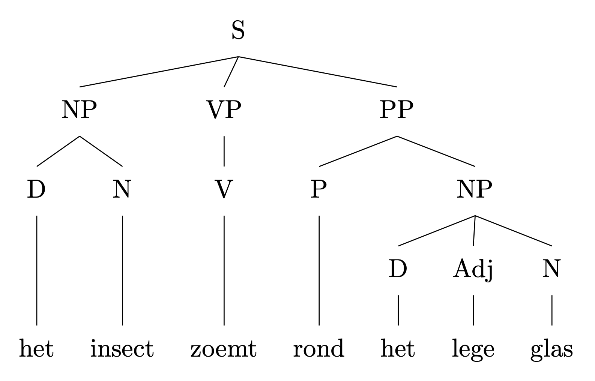

## Weergave constituentenstructuur: boomstructuur

Boomstructuur om hiërarchie te visualiseren

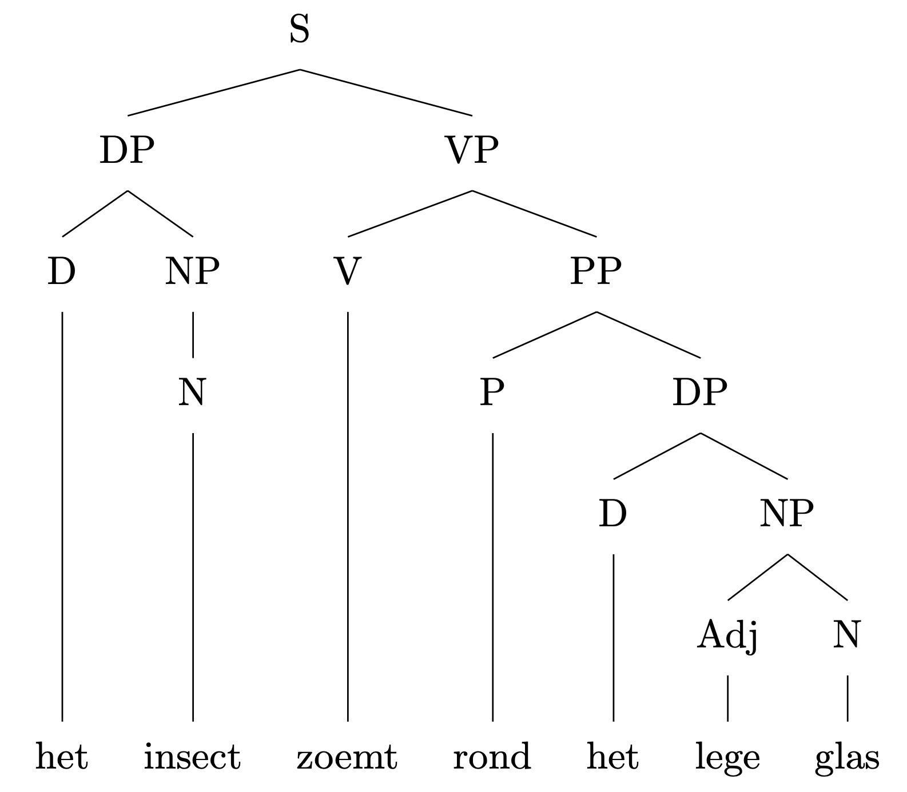

## Weergave constituentenstructuur: korte evaluatie

Goede aspecten

* constituenten afbakenen
* hiërarchie aanduiden

Minder goede aspecten

* relaties tussen constituenten
* rol van morfologie zeer klein
* rol van betekenis vrijwel afwezig

## Een wildgroei aan theorieën

Er is een enorme diversiteit aan voorstellingen.

Hangt vaak samen met theorie en het punt dat men wil maken.

Niet alle theorieën vereisen weergaves zoals herschrijfregels of boomstructuren.

[Noot: in de oefeningen van ATW1 wordt dit ook niet gevraagd]{.alert}

## Een wildgroei aan theorieën

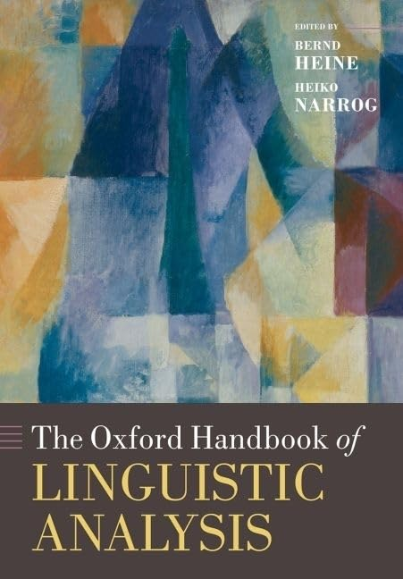

## Een wildgroei aan theorieën

:::: {.columns}

::: {.column width="33%"}
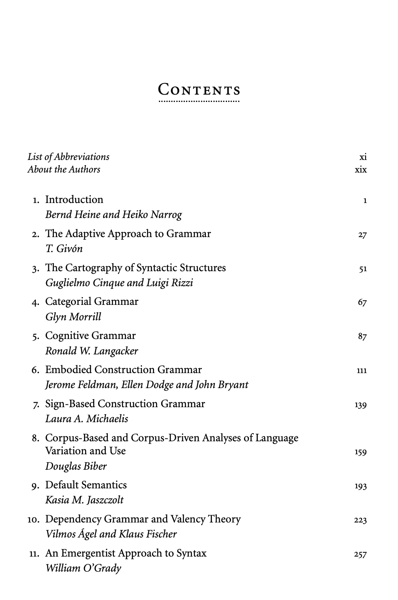

:::

::: {.column width="33%"}
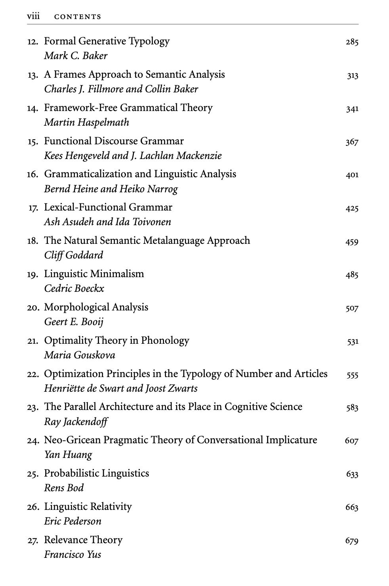

:::

::: {.column width="33%"}
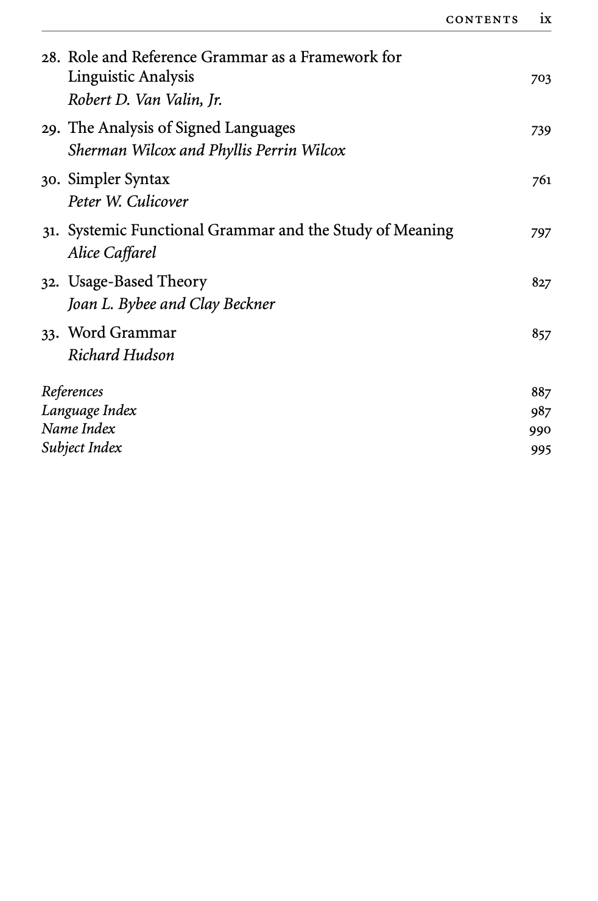

:::

::::

## Een wildgroei aan theorieën

Hierna volgen enkele voorbeelden van theorieën en frameworks die nog courant zijn.

Maar dit is puur illustratief (wordt niet verondersteld op het examen).

De voorbeelden tonen aan dat taalkundige analyse een rijke diversiteit kent.

Je zal een aantal van deze benaderingen nog tegenkomen tijdens je bachelorstudies hier.

Maar wie weet hoor jij later ook thuis in dit soort overzicht!

## Cartografie van syntactische structuren 

Geassocieerde namen: Rizzi & Cinque

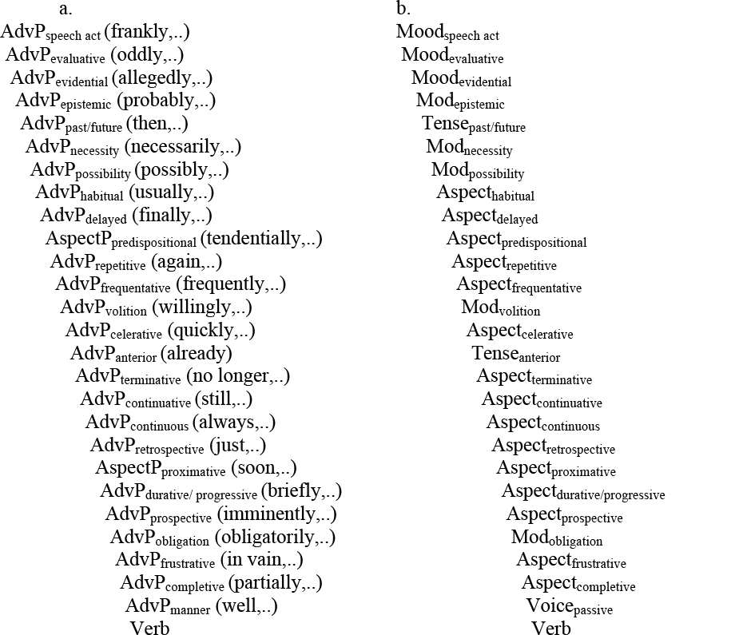

## Minimalism

Geassocieerde namen: Chomsky, Boeckx, Adger

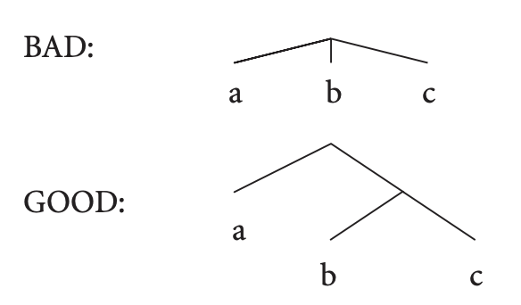{width=20%}
 
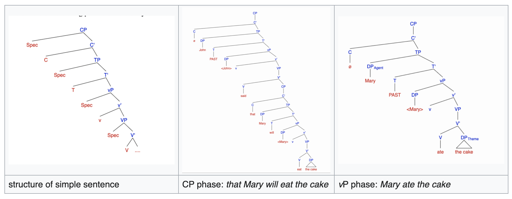

## Role and Reference Grammar

Geassocieerde namen: Van Valin, Lapolla

:::: {.columns}

::: {.column}
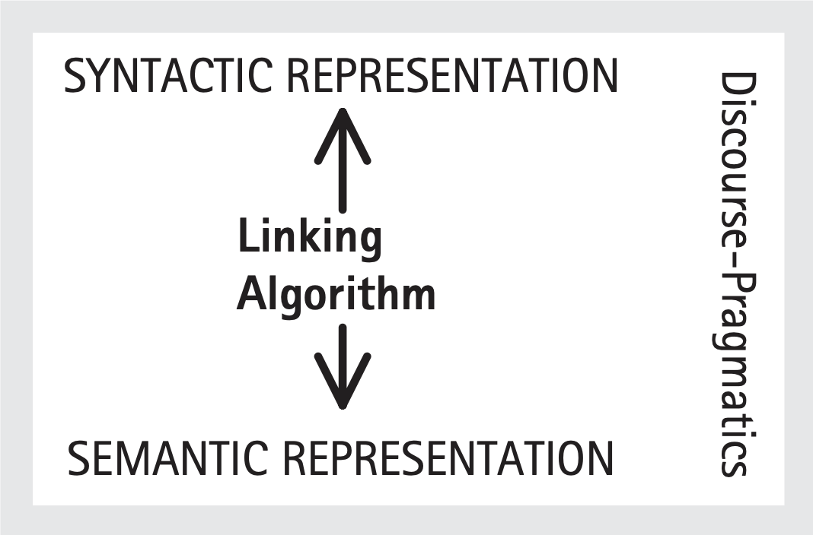

:::

::: {.column}
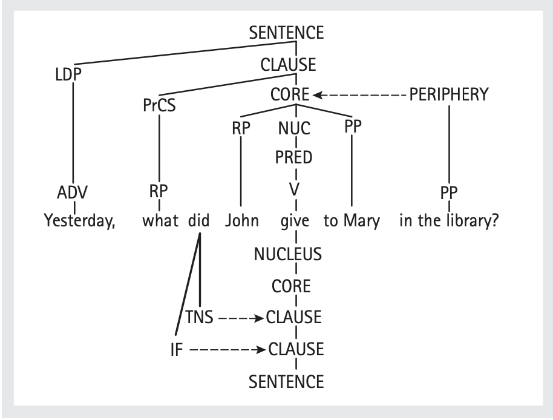

:::

::::

## Cognitive Grammar

Geassocieerde namen: Langacker, Tuggy, Taylor

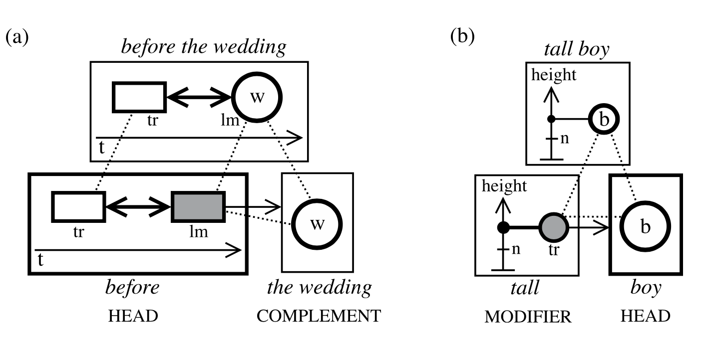

## Construction Grammar (CxG)

Geassocieerde namen: Goldberg, Hoffmann, Diessel, ... 

[Bill sneezed the napkin off the table.]{.ex}

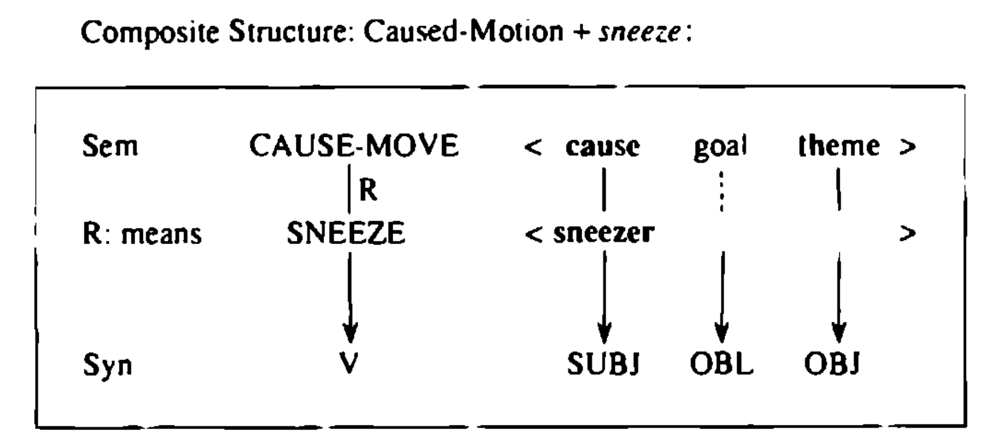

# Oefeningen

## Oefeningen syntaxis 

We maken oefening 3 en 4.

## Oefeningen fonologie en morfologie

We maken de ontbrekende oefeningen.

# Tegen volgende weken

## Vragen stellen

Stel gerust vragen via Toledo.

