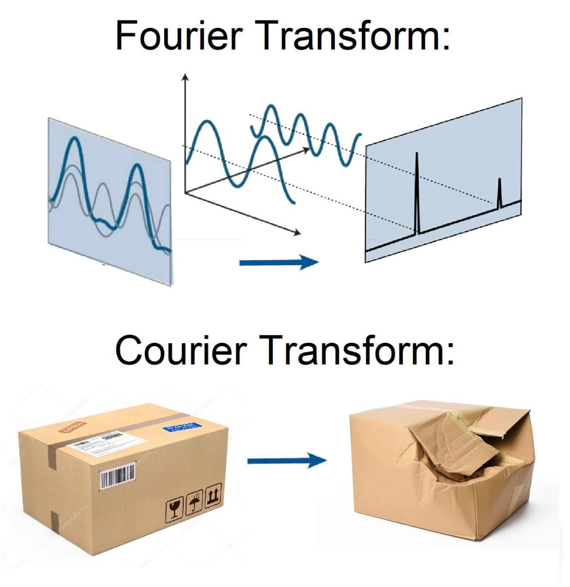

# Herhaling

## Fourier analyse

## Akoestische fonetiek in een notendop

* geluidsgolven = complexe signalen
  * quasi-periodisch (klinkers)
  * aperiodisch (medeklinkers)
* belangrijkste grootheden: amplitude (dB) + frequentie (Hz)
* decompositie in elementaire componenten (sinusgolven) via Fourier-analyse
* obv Fourier-analyse krijgen we fundamentele frequentie F0 + harmonischen   
→ spectrum analyse van klank (amplitude ~ frequentie, zonder tijdsdimensie)
* → spectrogram (frequentie ~ tijd, met amplitude als intensiteit)
* → laat ons toe om formanten en F0 visueel voor te stellen en te meten

# Fonologie

## Klanken in taal

Beginpunt: wat is de "afbakening" van klanken in taal?

* Nl. [\<boer>]{.ex} uitgesproken als [ˈbuːr], [ˈbuːʀ], [ˈbuːʁ]
* En. [\<spit>]{.ex} uitgesproken als [ˈspɪt] vs.   [\<pit>]{.ex} uitgesproken als [ˈpʰɪt]

→ Wat valt op in deze voorbeelden?

## Klanken in taal

Beginpunt: wat is de "afbakening" van klanken in taal?

* Nl. [\<boe**r**>]{.ex} uitgesproken als [ˈbuː**r**], [ˈbuː**ʀ**], [ˈbuː**ʁ**]
* En. [\<s**p**it>]{.ex} uitgesproken als [ˈs**p**ɪt] vs.   [\<**p**it>]{.ex} uitgesproken als [ˈ**p**ʰɪt]

In alle gevallen: fonetisch duidelijk verschillend.

Maar [intuïtie van sprekers (en orthografie): varianten van "dezelfde klank"]{.alert2}

::: {.fragment}
[→ Gaat het om dezelfde klank?]{.alert}

:::

## Fonologie vs. fonetiek

[Fonetiek]{.alert} = studie van [spraakklanken]{.alert2} in menselijke taal (concrete realisaties)

[Fonologie]{.alert} = studie van [klankcontrasten]{.alert2} in *een* menselijke taal (taalsysteem)

## Fonologie: functionele analyse

:::: {.columns}

::: {.column width="50%"}
[Umpithamu](https://en.wikipedia.org/wiki/Umpithamu_language){target="_blank"}  
( Paman < Pama-Nyungan) 

* [ɔˈjɔ[ɹ]{.ex}ɔ] ‘dolfijn’ vs.  [ɔˈjɔ[r]{.ex}ɔ] ‘stekel v/e rog’  
* [aˈpa[t]{.ex}a] vs [aˈpa[d]{.ex}a] ‘oudere zus'

::: {.fragment data-fragment-index="2"}
→ r vs ɹ : fonetisch verschillend, maar:

* functioneel  ‘verschillend’ in Umpithamu
* functioneel  ‘hetzelfde’ in Engels (met Schots accent)

:::

:::

::: {.column .fragment width="50%" data-fragment-index="1"}

Engels  
(Germanic < Indo-European)

* [ˈp[ɹ]{.ex}ɛzənt] vs [ˈp[r]{.ex}ɛzənt] ‘cadeau’  
* [ˈ[t]{.ex}aʊn] ‘stad’ vs [ˈ[d]{.ex}aʊn] ‘onder’

::: {.fragment data-fragment-index="3"}
→ t vs d : fonetisch verschillend, maar: 

* functioneel  ‘hetzelfde’ in Umpithamu (met ‘accent’)
* functioneel  ‘verschillend’ in Engels

:::

:::

::::

## Fonologie: functionele analyse

Klanken op zich hebben geen betekenis (niveau fonetiek)

maar kunnen wel betekenisonderscheid hebben (niveau fonologie).

Kernwoord voor fonologie is dus [distinctief]{.alert2} zijn.   (onthoud dit)

## Waarom fonologische analyse?

1. Praktisch nut, bv. ontwerpen orthografie  voor  een  taal: 

* moet minimaal de betekenis-onderscheidende contrasten kunnen representeren
* cf. orthografie van het Engels: contrast tussen /t/ \<t> en /d/ \<d>: \<town> vs \<down>
* cf. orthografie van het Umpithamu:  contrast tussen /r/ \<rr> en /ɹ / \<r>: \<oyorro > vs \<oyoro>
	
::: {.fragment}
2. Praktisch nut, bv.  leren van vreemde  talen: 

* contrasten die niet  fonemisch zijn in moedertaal, minder goedbeheerst ( productie  en  perceptie )
* fonologische analyse  helpt  te  voorspellen  waar  leerders problemen kunnen hebben
	* bv [l] vs [r] voor  Japanse  leerders van Nederlands
	* bv [ɹ] vs [r] voor  Engelstalige  leerders van Umpithamu
	* bv [p] vs [b] voor Chinese leerders van Nederlands
	* bv tonen voor Nederlandse leerders van het Chinees
	
:::

	
## Basisconcepten

Fonemische  klankcontrasten:

* met betekenis-onderscheidende  functie →  kunnen woorden van elkaar onderscheiden
* definiëren fonemen, i.e. aparte  segmenten in een  taal → basis voor  intuïties over ‘verschillende’ klanken

Bijvoorbeeld:  
- r vs ɹ in het Umpithamu  
- t vs d in het Engels

## Basisconcepten

Niet-fonemische  klankcontrasten:

*  zonder  betekenis-onderscheidende  functie → blijft ‘ hetzelfde ’ woord
 bv  Engels [ˈpɹɛzənt] vs [ˈprɛzənt] ‘cadeau’
* definiëren  allofonen ,‘ varianten ’ van hetzelfde  foneem → basis voor  intuïties over ‘ dezelfde ’ klank  ondanks  fonetisch  verschil

bv r vs ɹ in het Engels

## Transcriptiesystemen en -conventies

[fonetisch]{.alert2}: vierkante haken [ ]

[fonologisch]{.alert2}: slashes /  /

[orthographisch]{.alert2}: vishaken <   >

Taal   | Betekenis |   Orthografisch   |    Fonologisch    |   Fonetisch
-------|-------------------|-------------------|-----------
Engels |  'cadeau'  | \<present> | /ˈpɹɛzənt/ | [ˈpɹɛzənt], [ˈprɛzənt]
Umpithamu | 'stekel van een rog' | \<oyorro> | /ɔˈjɔrɔ/ | [ɔˈjɔrɔ]
Umpithamu | 'dolfijn' | \<oyoro>  | /ɔˈjɔɹɔ /  |   [ɔˈjɔɹɔ] 

## Allofonen: vrije variatie

[Allofonen]{.alert2} = varianten van 1 foneem

[Allofoon type 1:]{.alert} allofonen in [vrije variatie]{.alert2} 
  → voorkomen niet bepaald door fonetische context
  bv. NL [ˈbuːr] vs [ˈbuːʀ]

Belangrijk: die variatie is eigenlijk nooit helemaal "vrij": 
  hangt vaak af van sociale of geografische factoren

## Allofonen: complementaire distributie

[Allofonen]{.alert2} = varianten van 1 foneem

[Allofoon type 2:]{.alert} allofonen in [complementaire distributie]{.alert2}
  → voorkomen wel bepaald door fonetische context
  bv. Nl. \<kit> vs \<kat> 
   /k/  gerealiseerd als [k̟] bij voorklinker
   /k/  gerealiseerd als [k̠] bij achterklinker

## Allofonen: complementaire distributie

Nog voorbeelden van complementaire distributie

Duits: stemloze fricatief in \<ich> vs \<ach> 
  [iç] vs [ax] of [ɑχ]

Engels: stemloze bilabiale stop in \<spit> vs \<pit>
  [p] na [s] vs [pʰ] wanneer initieel

## Fonemen en allofonen naast elkaar

:::: {.columns}

::: {.column}
Engels

* [p] in [spɪn] 'draaien'
* [pʰ] in [pʰɪn] 'speld'
* [b] in [bɪn] 'vuilbak'

Als je [spʰɪn] of [pɪn] zou zeggen is dit wat "vreemd" of met een accent maar niet per se verkeerd. Maar er is wel een betekenisverschil tov [b]. Dus er zijn twee fonemen hier.

:::

::: {.column .fragment}
Thais

* [p] in [pâ:] 'tante'
* [pʰ] in [pʰâ:] 'doek'
* [b] in [bâ:] 'gek'

In the Thais zijn de drie klanken [p], [pʰ], [b] wel betekenisonderscheidend, dus fonemisch.

:::

::::

## Allofonen: complementaire distributie

→ [complementaire distributie]{.alert2}

* distributie: set van contexten waar klank voorkomt
* complementair: in context waar 1 klank voorkomt, komt de andere  niet  voor, en vice versa

::: {.fragment}
Link met allofonische status?

:::

::: {.fragment}
→ complementaire fonen kunnen niet contrasteren
  → geen fonemisch contrast
:::

## Allofonen: complementaire distributie

Maar: allofonen moeten wel een verwantschap hebben
  vgl. /h/ en /ŋ/ in Nl. zijn wel complementair (initieel vs. coda) maar worden niet als allofonen van elkaar beschouwd!

:::: {.columns}

::: {.column}
[ŋ]

* komt niet voor aan begin
* komt voor aan einde bv. [baŋ]
* kan voor medeklinker staan bv. [dεŋkən]
* kan niet voor klinker staan (?)
* kan voor schwa staan bv. [εŋəl]

:::

::: {.column}
[h]

* komt voor aan begin bv. [haŋən]
* komt niet voor aan einde 
* kan niet voor medeklinker staan bv. \*[dεhkən]
* kan voor klinker staan bv. [haŋən]
* kan niet voor schwa staan bv. \*[εhəl] (?)

:::

::::

Wat wel allofoon is met /h/ is de niet-realisatie ervan! 
  \<heel> als [heːl] of [eːl] of [ʔeːl]

## Enkele mogelijke allofonen van Engelse fonemen

:::: {.columns}

::: {.column width="20%"}
* /p/
* /t/
* /k/
* /m/
* ...

:::

::: {.column}
* [p], [pʰ], [p̚]
* [t], [tʰ], [t̚], [tʷ], [ʈ], [ɾ], [ʔ]
* [k], [kʰ], [k̚], [kʷ], [k̟], [k̟ʰ]
* [m], [ɱ]

:::

::::

Zie McGregor (2024:46) voor meer voorbeelden

## Notatiewijze allofonie

Beknopte notatiewijze om de relatie tussen allofonen en fonemen weer te geven: *slash-and-dash*

bv. Eng. /m/ wordt gerealiseerd als [ɱ] vóór een labiodentale fricatief. Anders is het [m]

::: {.fragment}
labiodentale fricativen zijn [f], [v]
:::

::: {.fragment}

$$
/m/ \to 
\begin{cases}
[ɱ] &/& \_ \{ [f], [v]\} \\ 
[m] &/& elsewhere \\
\end{cases}
$$

:::

# Procedure

## Procedure om fonologische analyse uit te voeren

0. Je krijgt een set gegevens uit een taal (die je wellicht niet kent)
  Opdracht: bepaal de fonologische status (foneem vs. allofoon) van klanken en klankcontrasten.

::: {.fragment}
Stappenplan

1. minimale paren zoeken + hypothese fonemisch contrast

2. bijna-minimale paren zoeken + hypothese fonemisch contrast

3. hypothese allofonie

:::

## Fonologische analyse: stap 1 (minimale paren)

Basiscriterium  fonemische status = betekenis-onderscheidende functie

→ zoeken  naar  minimale  paren  voor  dat contrast:

* betekenis  verschilt
* vorm  identiek  behalve  klankcontrast  
 bv [ɔˈjɔɹɔ] ‘dolfijn’ vs [ɔˈjɔrɔ] ‘stekel’ in Umpithamu
* zijn  er  minimale  paren ?  
ja → contrast is fonemisch!  
nee → ga verder naar stap 2

## Fonologische analyse: stap 2 (bijna-minimale paren)

Niet  alle  klankcontrasten  definiëren  minimale  paren   
(o.w.v. woordstructuur, belang contrast in systeem  etc.)

→ zoeken  naar  bijna-minimale  paren  voor  dat contrast:

* betekenis  verschilt
* vorm  *bijna*  identiek: relevant klankcontrast plus ander 	contrast, maar fonetisch zo identiek  mogelijk

bv Engels [ʃ] en [ʒ] in [ˈmiʃən] ‘missie’ vs [ˈviʒən] ‘visie’

* [m] vs [v] geen fonetische invloed (want *bijna* identiek: [+voice +bilabial]) 
* [ʒ] door ontlening uit Frans → minder frequent
* → dus geen allofonen maar fonemen

## Fonologische analyse: stap 2 (bijna-minimale paren)

Niet  alle  klankcontrasten  definiëren  minimale  paren   
(o.w.v. woordstructuur, belang contrast in systeem  etc.)

→ zoeken  naar  bijna-minimale  paren  voor  dat contrast  
[maar hoe zoek je die]{.alert2}

* manueel, zoals minimale paren
* via systematische studie van de distributie (stap 3)

Tip:

* Vind je bijna-minimale paren? → Contrast is fonemisch!
* Vind je geen bijna-minimale paren? → ga verder naar stap 3

## Fonologische analyse: stap 3 (allofonen)

Je moet dan bepalen of het om [vrije variatie]{.alert2} gaat, of om [complementaire distributie]{.alert2}

Stappen:

* Lijst de contexten (distributie) op
* Vergelijk de contexten
* Bepaal de beregeling en de basisvorm  
Tip: wees economisch

## Toepassing: Mokilees (Oceanic < Austronesian)

[Data:]{.alert2}

fonetic | meaning | fonetic | meaning
--------|---------|---------|--------
[pi̥san] |	'full of leaves' |	[uduk]|	‘meat’
[dupu̥kda] |	‘bought’	|	[kaskas]	|‘to throw’
[pu̥ko]	| ‘basket’ | [poki]	|	‘to strike' 
[ki̥sa]	|	'we two'	|	[pil]	|	'water'
[su̥pwo] |	'firewood' |		[ apid ] | 	'support'
[kamwɔki̥ti] | 	'to move'	| 	[iju]	|	'to tackle’

[Vraag: wat is de fonologische status van stemgeving bij gesloten  klinkers?]{.alert2}

(Noot: het teken dat stemloosheid aanduidt staat onder de klinker.)

## Toepassing: Mokilees (Oceanic < Austronesian)

[Vraag: wat is de fonologische status van stemgeving bij gesloten  klinkers?]{.alert2}

::: {.fragment .fade-in-then-semi-out}
Wat denk je dat de eerste stap is?

:::

::: {.fragment .fade-in-then-semi-out}
Denk na, wat zijn gesloten klinkers?

:::

::: {.fragment}
gesloten klinkers = hoge klinkers
  komen in aanmerking: [i, y, ɨ, ʉ, ɯ, u]
   tip: diacritische tekens zijn ook belangrijk
:::

## Toepassing: Mokilees (Oceanic < Austronesian)

[Vraag: wat is de fonologische status van stemgeving bij gesloten  klinkers?]{.alert2}
  [[i, y, ɨ, ʉ, ɯ, u]]{.alert2}

fonetic | meaning | fonetic | meaning
--------|---------|---------|--------
[pi̥san] |	'full of leaves' |	[uduk]|	‘meat’
[dupu̥kda] |	‘bought’	|	[kaskas]	|‘to throw’
[pu̥ko]	| ‘basket’ | [poki]	|	‘to strike' 
[ki̥sa]	|	'we two'	|	[pil]	|	'water'
[su̥pwo] |	'firewood' |		[ apid ] | 	'support'
[kamwɔki̥ti] | 	'to move'	| 	[iju]	|	'to tackle’

::: {.fragment}
→ komen in aanmerking uit onze data:  
[[i, i̥, u, u̥]]{.alert2}

:::

## Toepassing: Mokilees (Oceanic < Austronesian)

Vraag: gaat over [[i, i̥, u, u̥]]{.alert2}

fonetic | meaning | fonetic | meaning
--------|---------|---------|--------
[pi̥san] |	'full of leaves' |	[uduk]|	‘meat’
[dupu̥kda] |	‘bought’	|	[kaskas]	|‘to throw’
[pu̥ko]	| ‘basket’ | [poki]	|	‘to strike' 
[ki̥sa]	|	'we two'	|	[pil]	|	'water'
[su̥pwo] |	'firewood' |		[ apid ] | 	'support'
[kamwɔki̥ti] | 	'to move'	| 	[iju]	|	'to tackle’

::: {.fragment}
Stap 1: minimale paren?

:::

::: {.fragment}
→ die zijn er niet  
→ we gaan naar stap 2

:::

## Toepassing: Mokilees (Oceanic < Austronesian)

Vraag: gaat over [[i, i̥, u, u̥]]{.alert2}

fonetic | meaning | fonetic | meaning
--------|---------|---------|--------
[pi̥san] |	'full of leaves' |	[uduk]|	‘meat’
[dupu̥kda] |	‘bought’	|	[kaskas]	|‘to throw’
[pu̥ko]	| ‘basket’ | [poki]	|	‘to strike' 
[ki̥sa]	|	'we two'	|	[pil]	|	'water'
[su̥pwo] |	'firewood' |		[ apid ] | 	'support'
[kamwɔki̥ti] | 	'to move'	| 	[iju]	|	'to tackle’

::: {.fragment}
Stap 2: bijna-minimale paren?

:::

::: {.fragment}
→ [du**pu̥k**da] ‘bought’ vs [u**duk**] ‘meat’?
 
→ we gaan naar stap 3

:::

## Toepassing: Mokilees (Oceanic < Austronesian)

fonetic | meaning | fonetic | meaning
--------|---------|---------|--------
[pi̥san] |	'full of leaves' |	[uduk]|	‘meat’
[dupu̥kda] |	‘bought’	|	[kaskas]	|‘to throw’
[pu̥ko]	| ‘basket’ | [poki]	|	‘to strike' 
[ki̥sa]	|	'we two'	|	[pil]	|	'water'
[su̥pwo] |	'firewood' |		[ apid ] | 	'support'
[kamwɔki̥ti] | 	'to move'	| 	[iju]	|	'to tackle’

::: {.fragment}
Stap 3: allofonen voor [[i, i̥, u, u̥]]{.alert2}?

:::

::: {.fragment}

[i̥]	|	[u̥]|		[i]	|	[u]
-----|-------|------|----
p_s  | p_k | k_#	| 	#_d
k_s  | s_p | p_l  | d_k
k_t  |     | p_d |   d_p
|   |   |   #_j | j_#
|   |   |   t_# | 

:::

## Toepassing: Mokilees (Oceanic < Austronesian)

[i̥]	|	[u̥]|		[i]	|	[u]
-----|-------|------|----
p_s  | p_k | k_#	| 	#_d
k_s  | s_p | p_l  | d_k
k_t  |     | p_d |   d_p
|   |   |   #_j | j_#
|   |   |   t_# | 

[→ Generalisatie?]{.alert2}

::: {.fragment}

* gesloten klinkers stemloos tussen twee stemloze medeklinkers, stemhebbend elders
* complementaire distributie → allofonie

:::

## Toepassing: Mokilees (Oceanic < Austronesian)

Generalisatie 

* gesloten klinkers stemloos tussen twee stemloze medeklinkers, stemhebbend elders
* complementaire distributie → allofonie

::: {.fragment}
Formalisatie

$$/i/ \to \begin{cases}
[i̥ \,] &/ &  C_{voiceless}\, \_\, C_{voiceless } \\
[i] &/ & elsewhere
\end{cases}
$$

$$/u/ \to \begin{cases}
[u̥ \,] &/ &  C_{voiceless}\, \_\, C_{voiceless } \\
[u] &/ & elsewhere
\end{cases}
$$

:::

## Hoe bepaal je de basisvorm?

Foneem = abstractie  
maar heeft wel een label nodig  
→ een van de allofonen

Keuze *in geval van Mokilees* = [stemhebbend allofoon]{.alert2}

Waarom?

*	stemloos in beperktere set contexten
*	stemloze variant zeldzamer cross-linguïstisch
*	contexten stemloos ‘natuurlijke klasse’
* de "elsewhere condition" is meestal de grootste groep

# Oefeningen

## Fonetiek

:::: {.columns}

::: {.column}

1. 
2. 
3. 
4. 
5. 
6. 

:::

::: {.column .incremental}

1. Quechua [*qapaq*](https://en.wiktionary.org/wiki/qapaq#Quechua) [ˈχa.paχ]
2. Cantonese [*syut*](https://en.wiktionary.org/wiki/%E9%9B%AA) [syt̚ ˧]
* noot: Tonen moet je niet kunnen geven
3. Japans [*manju*](https://en.wiktionary.org/wiki/manju#Japanese) [ˈmãn.d͡ʒɯ]
4. Ests [*kaine*](https://en.wiktionary.org/wiki/kaine) [ˈkɑi.ne]
5. Duits [*keine*](https://en.wiktionary.org/wiki/keine) [ˈkʰaɪ.nə]
6. Am. Engels [*lingerie*](https://en.wiktionary.org/wiki/lingerie#Pronunciation) [ˌlɑ̃n.ʒəˈɹe(ɪ)]
:::

::::

## Fonologie

Naargelang de tijd maken we nu een of enkele oefeningen.

::: {.incremental}
Stappenplan

* Stap 1. Zoek verdachte paren.   (Hier al gegeven.)
* Stap 2. Zoek minimale paren
  * geen minimale paren
* Stap 3. Zoek bijna-minimale paren
  * geen bijna-minimale paren
* Stap 4. Soort allofonie?
  * vrije variatie?
  * complementaire distributie?
* Stap 5. Regel?

:::

# Tegen volgende week

[Bereid zelf (of in groep) de volgende twee oefeningen van fonologie voor]{.alert2}

