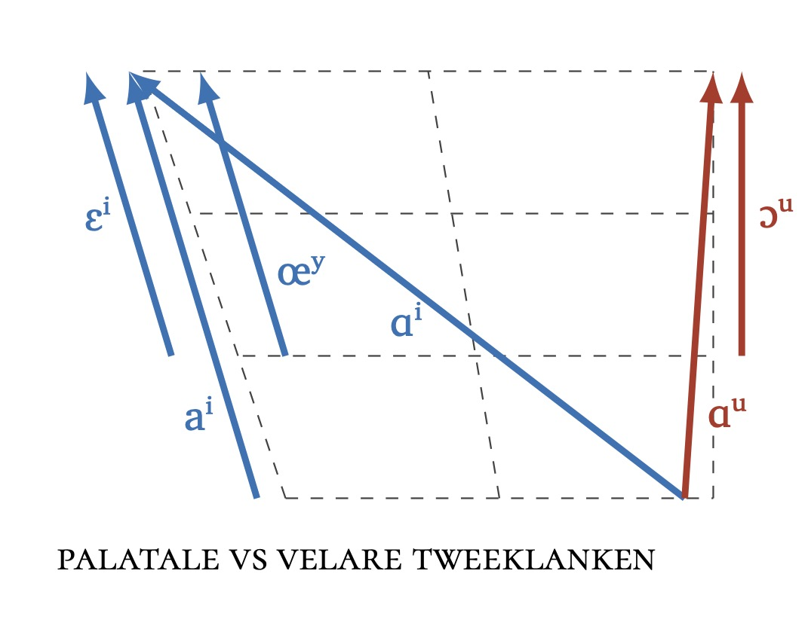
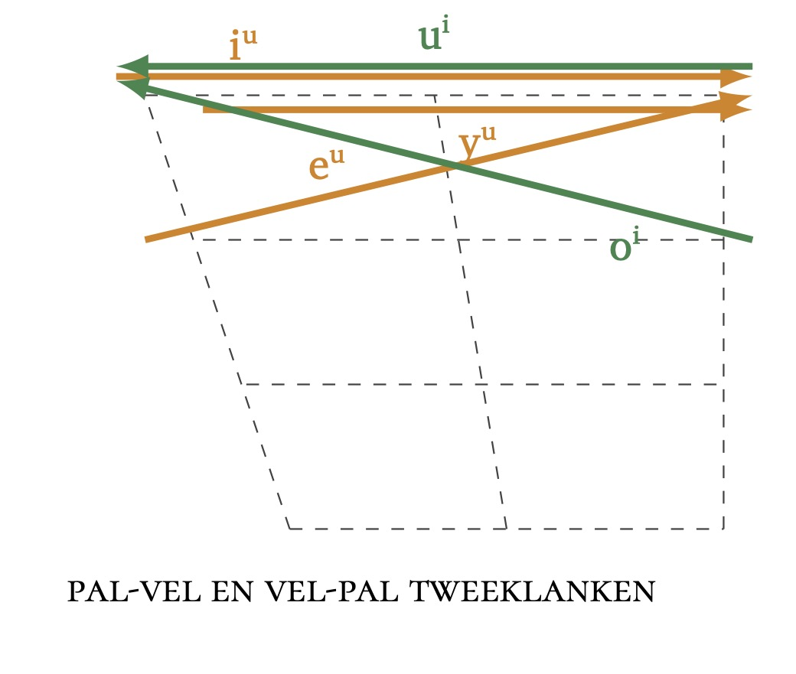
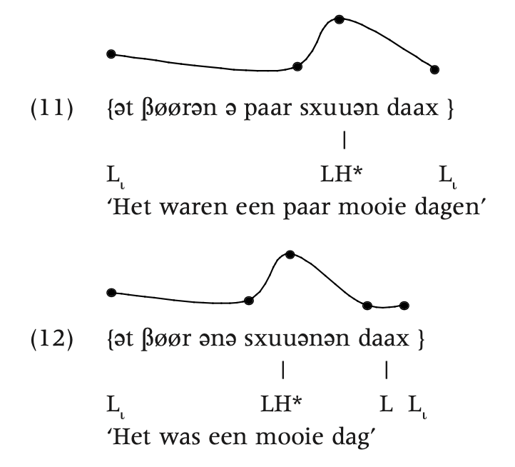
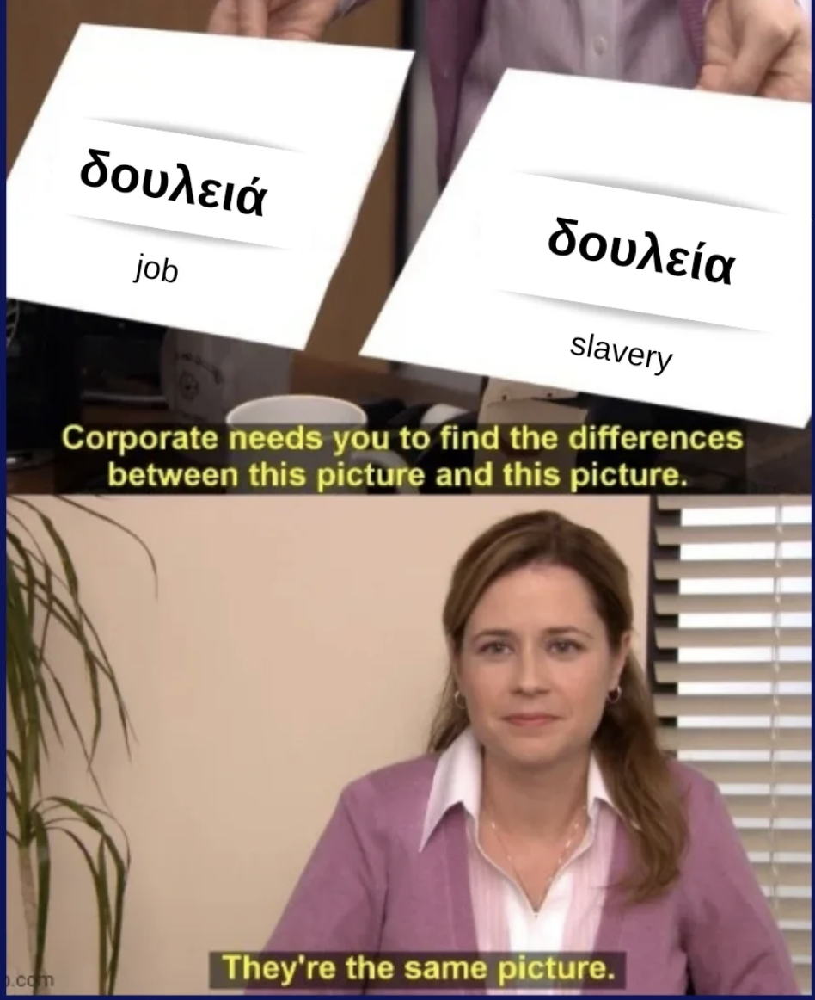

# Herhaling van vorige week

## Fonologische analyse

3 soorten spraakklanken

* fonemen: contrastief, betekenisonderscheidend
* allofonen in complementaire distributie: de fonetische context bepaalt welke variant waar kan staan
* allofonen in vrije variatie: optioneel, geen contextuele beperkingen

Fonemen zijn de basiselementen van de fonologische grammatica <br> (het regelsysteem)

* welke klanken in welke taal ‘gefonologiseerd’ zijn als fonemen is onderhevig aan
variatie
* voor sprekers zijn de fonemen uit hun moedertaal typisch meest prominent;
andere klanken zijn vaak moeilijk aan te leren (bv. in L2, L3-taalverwerving).

## Met andere woorden

> Phonetics gathers raw material, while phonemics cooks it."
> 
> Kenneth Pike (1947:57)


# Fonologie


## Gooniyandi nasale velaren

[Gooniyandi](https://en.wikipedia.org/wiki/Guniyandi_language){target="_blank"} (Bunuban, [Australië](https://glottolog.org/resource/languoid/id/goon1238){target="_blank"})

Laten we de [fonemische inventaris](https://en.wikipedia.org/wiki/Guniyandi_language){target="_blank"} even bekijken.

Opdracht: oefening 9 in McGregor (2024:53).

## Gooniyandi nasale velaren

fonetic | meaning | fonetic | meaning
--------|---------|---------|--------
| [**ŋ̟**iːdi] | 'we' | [**ŋ̟**ela] | 'east'
[ji**ŋ̟**i] | 'name' |  [mɑ**ŋ**u] | 'Mangu'  (place name)
[juʊ**ŋ**gu] | 'scrub' | [**ŋ**ʊmbaɳɒ] | 'husband'
[**ŋ**ɑːbu] | 'father' | [bıɾa**ŋ̟**i] | 'their'
[**ŋ**ɑː**ŋ̟**g̟i] | 'your' |  [**ŋ**aɭʊdu | 'three'

Vraag: 
<br> Wat is de fonologische status van de klanken **[ŋ]** en **[ŋ̟]** in het Gooniyandi? 
<br> Zijn ze contrastief (en dus fonemisch), of allofonen van één enkel foneem (al dan niet in complementaire distributie)?

→ Is er iemand die het al meteen ziet?

## Stappenplan

fonetic | meaning | fonetic | meaning
--------|---------|---------|--------
| [**ŋ̟**iːdi] | 'we' | [**ŋ̟**ela] | 'east'
[ji**ŋ̟**i] | 'name' |  [mɑ**ŋ**u] | 'Mangu'  (place name)
[juʊ**ŋ**gu] | 'scrub' | [**ŋ**ʊmbaɳɒ] | 'husband'
[**ŋ**ɑːbu] | 'father' | [bıɾa**ŋ̟**i] | 'their'
[**ŋ**ɑː**ŋ̟**g̟i] | 'your' |  [**ŋ**aɭʊdu | 'three'


::: {.incremental}
* Stap 1. Zoek verdachte paren.   (Hier al gegeven.)
* Stap 2. Zoek minimale paren
  * geen minimale paren
* Stap 3. Zoek bijna-minimale paren
  * geen bijna-minimale paren
* Stap 4. Soort allofonie?
  * vrije variatie?
  * complementaire distributie?
* Stap 5. Regel?

:::

## Gooniyandi nasale velaren

Distributie

**[ŋ]** | **[ŋ̟]**
-------|-------
a_u    |  a_i
ʊ_g    |  ɑː_g̟
 #_ɑː  |  #_iː
 #_a   |  #_e
 #_ʊ   |  i_i


::: {.fragment}
*Veralgemening*
<br> De allofonen zijn in complementaire distributie 

* **[ŋ̟]** verschijnt voor een voorklinker of een naar voor gearticuleerde allofone variant, bv. [g̟]
* **[ŋ]** verschijnt elders.

:::

## Gooniyandi nasale velaren


**[ŋ]** | **[ŋ̟]**
-------|-------
a_u    |  a_i
ʊ_g    |  ɑː_g̟
 #_ɑː  |  #_iː
 #_a   |  #_e
 #_ʊ   |  i_i


Regel

$$
/ŋ/ \to \begin{cases}
[ ŋ̟̟ \,] &/ & \_\_[+voor] \\
[ŋ] &/ & elsewhere
\end{cases}
$$

## Van fonemen naar kenmerken en "feature bundles"

De regel [$\mathbf{ /ŋ/ \to [ŋ̟] / \_\_[+voor] }$]{.alert} verwijst niet rechtstreeks naar een of
meerdere conditionerende klanken, maar wel naar [één bepaalde eigenschap]{.alert2}
die een hele klasse van fonemen/allofonen gemeenschappelijk hebben.

::: {.fragment}
→ klanken die een [kenmerk (**feature**)]{.alert2} gemeenschappelijk hebben
vormen een [natuurlijke klasse]{.alert}, waarnaar fonologische regels kunnen
verwijzen (bv. regels met betrekking tot de distributie van allofonen).


:::

::: {.fragment}
Fonemen kunnen beschouwd worden als "bundels van kenmerken" ([feature bundles]{.alert2})

→ Typische natural classes met feature bundles: plaats en wijze van articulatie.

:::

## Van fonemen naar kenmerken en "feature bundles"

Voordeel van het werken met kenmerken: descriptieve/analytische economie.
<br> bv. bij het formuleren van een allofoonregel omschrijf je de conditionerende
omgeving, ipv een opsomming van conditionerende klanken te geven.

Voorbeelden

* binair: $[\pm stem], [\pm hoog], [\pm laag], [\pm nasaal], ...$
* plaats: [labiaal], [palataal], [alveolair], ...

## Wanneer verwijs je bij het oplossen naar kenmerken?

1. als er effectief sprake is van een natuurlijke klasse 
<br>(gebaseerd op de data die je hebt!!)

2. als dit gemakkelijker is dan een lange opsomming te geven

Let wel: 
<br> een opsomming van condities is even juist als een economische samenvatting met features.

## Feature bundles voorbeeld

orthografisch  |  fonetisch  |   orthografisch  | fonetisch
---------------|-------------|------------------|------------
kat           |  [kɑt]       |     katten       |  [kɑtən]
hond           |  [hɔnt]       |     honden       |  [hɔndən]
schaap           |  [sxa:p]       |     schapen       |  [sxa:pən]
haas           |  [ha:s]       |     hazen       |  [ha:zən]

::: {.fragment .fade-in-then-semi-out}
Regel?

:::

::: {.fragment}
$[+voice, +plosive] \to [-voice, +plosive] \, / \, \_\_\#$
:::

# Tweeklanken

Niet zo gemakkelijk - combinatie van fonetiek en fonologie

## Nederlands



## Nederlands




# Suprasegmentele fonologie

## Prosodische hiërarchie

Idee: verschillende niveaus in suprasegmentele (prosodische) analysie in de fonologie
<br> → [prosodische hiërarchie]{.alert2}

1. intonatiegroep $\approx$ 1 enkelvoudige zin
2. prosodische groep $\approx$ 1 of meerdere syntactische constituenten
3. prosodisch woord $=$ groep met 1 hoofdklemtoon
4. voet $=$ groepering van 1-3 lettergrepen
5. lettergreep / syllabe $=$ 1 vocalische kern, met optioneel consonantisch materiaal ervoor en/of erna
6. mora $=$ 1 enkele tijdseenheid

## Mora

::: columns
::: {.column width="60%"}
Voorbeeld:

NL. *pokémon* [po.kɛ.mon] 
<br> \< *pocket monster* [po.kɛt.mon.stər] 
<br> (bewust Nederlandse uitspraak)

::: {.fragment}
Jap. [po.ke.mo.n] (4 morae) 
<br> \< [po.ke.t.to.mo.n.sɯ.ta.a] (9 morae)
<br>uit zich ook in schriftbeeld:
<br> ポケモン <　ポケットモンスター

:::

:::

::: {.column width="40%"}


:::
:::


## Wat is een haiku?

:::: {.columns}

::: {.column .fragment}
5-7-5 lettergrepen in het Nederlands


Golven - [Herman Van Rompuy](https://www.vrt.be/vrtnws/nl/2010/03/30/_haiku_herman_bundeltzijnjapanseverzen-1-747781/){target="_blank"}
<br><br>
Drie golven rollen 
<br> samen de haven binnen
<br> het trio is thuis.


:::


::: {.column .fragment}
5-7-5 morae in het Japans

*De koekoek* - [Kobayahi Issa](https://en.wikipedia.org/wiki/Kobayashi_Issa){target="_blank"}
<br><br>
江戸の雨
<br>何石呑んだ
<br>時鳥
<br>
<br>e.do no a.me
<br>na.n go.ku no.n.da
<br>ho.to.to.gi.su
<br>
<br>*of Edo's rain*
<br>*how many mouthful did you drink,*
<br>*cuckoo?*
:::

::::


## Lettergreep - fonemische toon

We hebben al gezien dat Mandarijn en Kantonees toontalen zijn.

Die kunnen fonetisch beschreven worden dmv IPA. 

Maar natuurlijk is het punt net dat die tonen fonemisch ("tonemisch") zijn.

```{r}
library(glossr)
use_glossr()

mama <- as_gloss(
  "媽媽 罵 麻 馬 嗎",
  "ma˥ma ma˥˩ ma˧˥ ma˨˩˧ ma?",
  "moeder schelden hennep paard Q",
  translation = "Scheldt moeder het strooien paard uit?",
  source = "Mandarijn"
)

gokgo <- as_gloss(
  "各個 國家 有 各個 國家嘅 國歌",
  "gok3go3 gwok3gaa1 jau5 gok3go3 gwok3gaa1=ge3 gwok3go1",
  "elk land hebben elk land=GEN volkslied",
  translation = "Elk land heeft zijn eigen volkslied",
  source = "Kantonees"
)

mama
```

## Lettergreep - fonemische toon

```{r}
gokgo
```

## Lettergreep - fonemische toon

Limburgs (hier uit Kerkerade)

:::: {.columns}

::: {.column}


:::

::: {.column}


Let op het toonverschil bij [daax].
:::

::::

## Lettergreep - klemtoon

Ook dit hebben we al gezien bij fonetiek.

Sommige talen hebben een "vaste klemtoonregel"

* Frans: laatste lettergreep van de prosodische groep
<br> *le fabuleux dest[in]{.alert2} d'Amélie Poul[ain]{.alert2}*
* Fins: klemtoon steeds op eerste lettergreep 
<br> *[Hel]{.alert2}singin [y]{.alert2}liopisto* 'de universiteit van Helsinki'

::: {.fragment}
Andere talen hebben een fonemische klemtoon

* Nieuw-Grieks
<br>/ˈpinɔ/ 'ik drink' vs. /piˈnɔ/ ‘ik heb honger’
<br>/aˈθina/ 'Athene (stad)' vs. /aθiˈna/ 'Athene (godin,
vrouwennaam)' 

:::

## Lettergreep - klemtoon




## Lettergreep

[Lettergreep (syllabe)]{.alert2}: heel vaak meest evidente notie van kleinste prosodische groep (maar niet altijd, Japans: morae)

Geen absolute consensus over wat correcte definitie is.

Maar vaak wel: vocalische kern (klinker, tweeklank, syllabische nasaal / approximant / rhotische klank...), met optioneel consonantisch materiaal ervoor en erna.

## Lettergreep

[Syllabestructuur]{.alert2}

* Minder vaak heel simpel: V, CV
* [Vaakst](https://wals.info/chapter/12){target="_blank"} iets minder complex: voorgaande + CVC, CCV
* Vaak complex: voorgaande + extra <br> bv. Engels: CVC, CCVC, CVCC etc

## Lettergreep

:::: {.columns}

::: {.column}
Basisstructuur van de lettergreep (σ)

:::

::: {.column}
```{mermaid}
flowchart TD
    A(σ) -->B(aanzet)
    A --> C(rijm) 
    C --> D(nucleus)
    C --> E(coda)
```

:::

::::

## Fonotactische regels

Fonologen proberen vaak om principes van welgevormdheid te formuleren.

Bijvoorbeeld Engels:

:::: {.columns}

::: {.column}
* ✓ /hεlp/ vs. \* /hεpl/
* ✓ /lʌmp/ vs. \* /lʌpm/
* ✓ /hard/ vs. \* /hadr/


:::

::: {.column}
* ✓ /pleı/ vs. \* /lpeı/
* ✓ /preı/ vs. \* /rpeı/
* ✓ /kwık/ vs. \* /wkık/
* ✓ /kju:/ vs. \* /jku:/

:::

::::

Vaak heeft de welgevormdheid te maken met de [sonoriteitshiërarchie]{.alert2}

## Fonotactische regels

[Sonoriteitshiërarchie](https://en.wikipedia.org/wiki/Sonority_hierarchy)


$open V > gesloten V > \frac{approximant}{liquida} > nasaal > fricatief > occlusief$

$hoog \, in \, sonorantie \leftarrow----------\rightarrow laag \, in \, sonorantie$

Sonoriteitsprincipe: 

* vóór de nucleus zijn segmenten geordend in stijgende mate van sonoriteit, 
* na de nucleus in dalende mate van sonoriteit.

bv.  NL *flat*, *elf*, *bank*, *korf*, *knik*, *fris*


## Foneeminventarissen

Vaak is de architectuur van talen niet arbitrair, maar gedreven door symmetrie (André Martinet)

Synchroon: uit zich in fonemische kenmerken
 
* bv  klinkerhoogte in het Nederlands: voorklinkers hebben vaak parallel in achterklinkers
* bv  stemgeving  bij  occlusieven in het Engels: mooi parallel
<br> vergelijk  Nederlands: gap voor [+velar, +plosive, +voice], nl. /g/

## Foneeminventarissen

Diachroon: ontwikkelingen

bv. Nederlands 
<br>/g/ > /ɣ/, maar zorgt wel voor asymmetrie velaren: /ɣ, x, k, [?]{.alert2}/

bv. Engels
<br> /sk/ > /ʃ/  (vgl doubletten als *skirt* – *shirt* )
<br> → systematisch contrast stemgeving uit balans
<br> → reactie: ontwikkeling /ʒ/ (uit Frans /zj/ > /ʒ/) als foneem in Engels
<br> → symmetrie hersteld


# Alvast voor volgende week, en dan oefeningen

## Volgende week

* Fonologische veranderingen (handboek pp. 388-393)

* Begin morfologie

* Oefeningen

Noot: het is dan open lesweek, dus kom zeker op tijd.

## En dan nu, oefeningen fonologie


