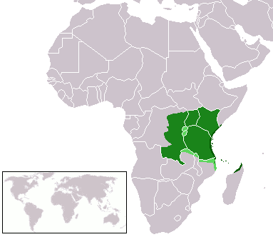
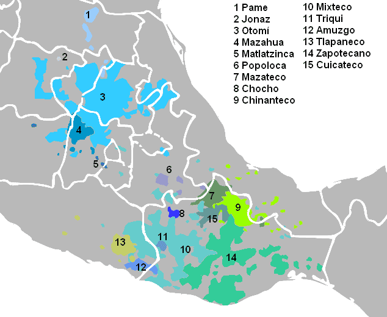

# Herhaling vorige week

## Morfologie

[Morfeem]{.alert2} = kleinste eenheid van vorm en betekenis

→ Splitsen in morfemen = 
 zoektocht naar die kleinste eenheden

## Kiswahili

:::: {.columns}

::: {.column}
Swahili / Kiswahili [fonologie](https://en.wikipedia.org/wiki/Swahili_language#Phonology){target="_blank"}

Bantoetaal (Niger-Congo familie)

:::

::: {.column}

:::

::::

## Kiswahili Oefening

Morfologie oef. 1

## Kiswahili Oefening

Wat hierin zit

* grammaticale vs. lexicale morfemen
* persoon en getal (1sg, 1pl, 3sg, 3pl)
* tijd (heden, toekomst, verleden)
* valentie (hoeveel "slots" zijn er: mono- en divalent)
* templatische morfologie

## Turu oefening

Turu / Kinyaturu (in Tanzania)

Ook een Bantoetaal (Niger-Congo familie)

→ Gelijkaardig aan Kiswahili

## Turu oefening

Morfologie oef. 2

## Turu oefening

Wat hierin zit

* grammaticale vs. lexicale morfemen
* persoon en getal (1sg, 1pl, 3sg, 3pl)
* tijd (heden, toekomst, verleden)
* valentie (hoeveel "slots" zijn er: mono- en divalent)
* templatische morfologie
* allomorfie (probeer de regels te achterhalen)
* mogelijks realis (*a*) vs. irrealis (*go*) samen met actief ($\emptyset$) vs. passief (*\<u\>*) 

## Popoluca 

:::: {.columns}

::: {.column}
[Popoloca](https://en.wikipedia.org/wiki/Popoloca_languages)talen worden gesproken in Mexico.

Mixe-Zoque familie

Er zijn een aantal varianten.
Fonologie van de [noordelijke variant](https://en.wikipedia.org/wiki/Northern_Popoloca_language){target="_blank"}
:::

::: {.column}

:::

::::

## Popoluca oefening

Morfologie oef. 3

## Popoluca oefening

* grammaticale vs. lexicale morfemen
* persoon (en getal) (1sg, 2sg, 3sg)
* tijd (heden vs. non-heden)
* werkwoordelijke vs. naamwoordelijke (nl. possessief) parallellie
* allomorfie (1sg, 2sg) maar niet overal (3sg)

## Hongaars 

Morfologie oef. 4 houden we voor op het einde van het semester

## Extra oefeningen handboek

Zie pp. 75-78

* (5) Sabila
* (10) Babungo
* (11) Kuot

Eventueel ook

* (4) Gumbaynggirr
* (7) Northern Soto

# Tegen volgende week

Herhaal de oefeningen die we gemaakt hebben.

Druk oefeningen syntaxis af.

