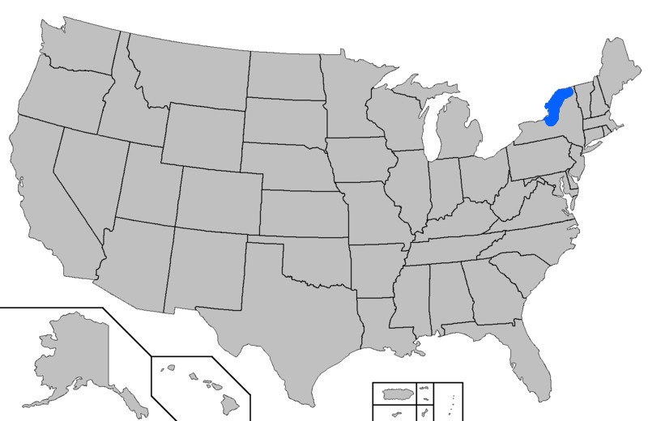
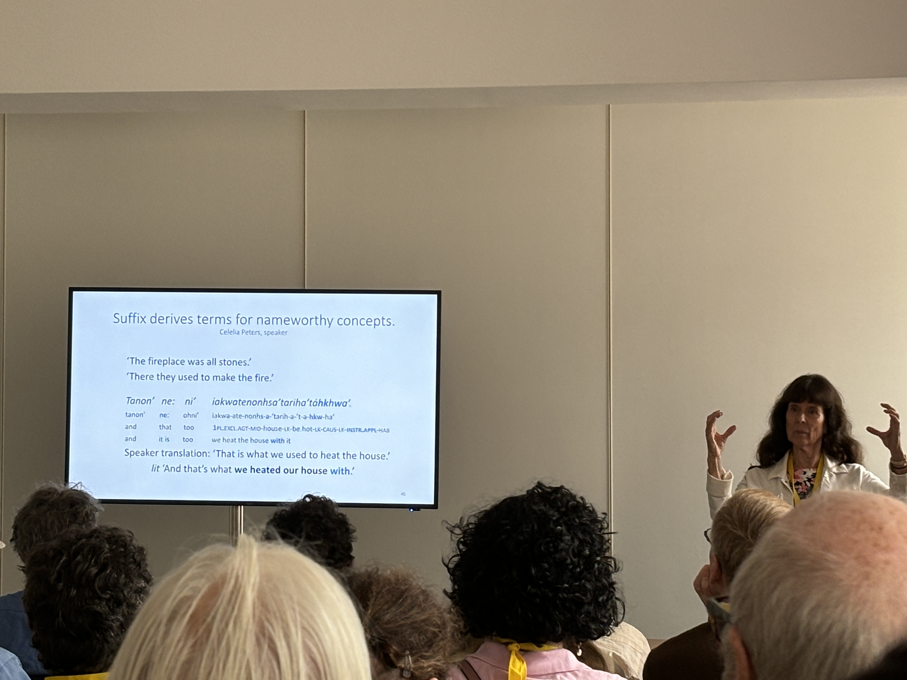

# Herhaling

## Oefening morfologie Popoluca

We maken deze oefening eerst verder af.


# Syntaxis

## Syntaxis - inleiding 

Syntaxis: studie van structuur van zinnen

→ elementen van analyse?

Stel, in deze voorbeeldzin:

[*De Britse  politie  arresteert  tien  verdachten.*]{.ex}

## Syntaxis - inleiding 


[1. eenheden ]{.alert2} tussen  woord- en  zinsniveau:

* *De Britse  politie  arresteert  tien  verdachten.*
<br> 
<br>[de Britse  politie]
<br>[tien  verdachten]
<br>[arresteren]

## Syntaxis - inleiding 

[2. relaties]{.alert2} tussen die eenheden:

*  *De Britse  politie  arresteert  tien  verdachten.*

→ wie doet wat?
<br>→ wie ondergaat wat?

```{mermaid}
flowchart LR
    A[De Britse politie] -.->|arresteert| B(tien verdachten)
```

## Syntaxis - inleiding 


[3. aspecten van morfologie]{.alert2} spelen een rol ("morfosyntaxis") <br>
vgl. inflectionele morfologie

*  *De Britse  politie  arresteert  tien  verdachten.*

→ wie doet wat? 
<br>→ wie ondergaat wat?
<br>
<br>→ [*arresteer-t*]{.ex}


## Taaltypes - heropfrissing

Morfo-syntactische types taal

1. isolerende talen
2. agglutinerende talen
3. fusionele talen
4. polysynthesische talen


## 1. isolerende taal

* vrijwel geen gebonden morfemen
* bijna elk woord monomorfemisch

```{r}
library(glossr)

morf_kc1 <- as_gloss(
  "(吾) 將 歸 蜜",
  "wú jiāng guī mì",
  "1 FUT terugbrengen honing",
  translation = "Ik zal de honing terugbrengen.",
  source = "Klassiek Chinees"
)

morf_kc1
```

## 2. agglutinerende taal

* morfologisch complexe woorden
* gemakkelijk te onderverdelen in morfemen
<br> idee van een trein met verschillende wagons

```{r}
morf_fin <- as_gloss(
  "tuo-n hunanja-n takaisin",
  "brengen-1.SG honing-ACC terug",
  translation = "Ik zal de honing terugbrengen.",
  source = "Fins"
)

morf_fin
```

##  3. fusionele / inflecterende taal

* morfologisch complexe woorden
* soms moeilijk om morfemen van elkaar te onderscheiden

```{r}
morf_lat <- as_gloss(
  "re-fer-am mel",
  "terug-dragen-1.SG.FUT honing.ACC.O",
  translation = "Ik zal de honing terugbrengen.",
  source = "Latijn"
)

morf_lat
``` 

##  4. polysynthetische taal

* morfologisch zeer complexe woorden
* morfemen kunnen niet gescheiden worden van elkaar

```{r}
morf_goo <- as_gloss(
  "ngalinya barn-ja-wi-l-arri",
  "honing terugkomen-SBJ-FUT-1SG-3SG.CL",
  translation = "Ik zal de honing terugbrengen.",
  source = "Gooniyandi"
)

morf_goo
```

## Relatie morfologie en syntaxis

taaltype       |     aandeel morfologie
---------------| ----------------------
isolerend       | zeer klein 
agglutinerend   | groter 
fusioneel       | groot
polysynthetisch  | grootst

## Een extreem voorbeeld van morfologie - Mohawk

:::: {.columns}

::: {.column}
[Mohawk](https://en.wikipedia.org/wiki/Mohawk_language){target="_blank"} 


:::

::: {.column}


:::

::::

## Een extreem voorbeeld van morfologie - Mohawk



## Een extreem voorbeeld van morfologie - Mohawk

```{r}
morf_moh <- as_gloss(
  "tanon' ne: ni' iakwatenonhsa'tariha'tahkhwa",
  "tanon' ne: ohni' iakwa-ate-nonhs-a'-tarih'-a-'t-a-hkw-ha'",
  "and that too 1PL.EXCL.AGT-MID-house-LNK-be.hot-LNK-CAUS-LNK-INSTR.APPL-HAVE",
  translation = "That is what we used to heat the house (fireplace)",
  source = "Mohawk"
)

morf_moh
```

## Constituenten

In een typische zin, bv. "[De journalisten zagen de man met de camera.]{.ex}" horen sommige woorden enger bij elkaar dan andere.

Die groeperingen noemen we een woordgroepen (*phrases*) of algemener [constituenten]{.alert2}.

Constituenten zijn de typische basiseenheid tussen woord- en zinsniveau.


## Constituenten - criteria

[De journalisten zagen de man met de camera.]{.ex}

→ 1. [verplaatsbaarheid]{.alert}: elementen van 1 groep  blijven  samen

* [Met de camera zagen de journalisten de man.]{.ex}
* [\*Camera zagen de journalisten de man met de.]{.ex}

## Constituenten - criteria

[De journalisten zagen de man met de camera.]{.ex}

→ 2. [vervangbaarheid]{.alert}: elementen van 1 groep  vervangbaar door 1 woord

* [**\[Ze\]** zagen de man met de camera.]{.ex}
* [De journalisten zagen **\[hem\]**.]{.ex}

## Constituenten - criteria

[De journalisten zagen de man met de camera.]{.ex}

→ 3. [ambiguïteit]{.alert}: interpretatieverschillen  gebaseerd op groepering

* [De journalisten zagen **\[de man met de camera\]**.]{.ex}
* [De journalisten zagen de man **\[met de camera\]**]{.ex}

## Constituenten - definitie

Constituenten = eenheden die

* bestaan  uit  één of meer  woorden
* samen een functie vervullen
<br> bv. werkwoordelijke groep, onderwerp, voorwerp etc.
* zelf constituenten kunnen bevatten ("inbedding")
<br> bv. \[de man \[met de camera\] \]

## Constituenten - hoofd vs. dependens

[hoofd]{.alert} = belangrijkste element: bepaalt  betekenis & syntactische status, kan  niet  weggelaten  worden  zonder  bijzonder effect, …

[dependens]{.alert} = modificeert het hoofd


Wat is het hoofd in deze Nederlandse voorbeelden?

* [gelukkige mensen]{.ex}
* [hard werken]{.ex}
* [in de kookpot]{.ex}


## Constituenten - hoofd vs. dependens

[hoofd]{.alert} = belangrijkste element: bepaalt  betekenis & syntactische status, kan  niet  weggelaten  worden  zonder  bijzonder effect, …

[dependens]{.alert} = modificeert het hoofd


Wat is het hoofd in deze Nederlandse voorbeelden?

* [gelukkige mensen]{.ex} **(type mensen, niet type geluk)**
* [hard werken]{.ex} **(type werken, niet type hardheid)**
* [in de kookpot]{.ex} **(type locatie, niet type kookpot)**


## Constituenten - types

Types constituent → types hoofd:
<br> vaak  gedefinieerd  adhv  woordsoorten 

[De erg kritische  journalisten  werden  gearresteerd  bij het parlement.]{.ex}

Types:

* NP (noun phrase): nomen  als  hoofd: *de erg kritische  journalisten*
* AdjP (adjective phrase): adjectief  als  hoofd: *erg kritische*
*	PP (prepositional phrase): prepositie  als  hoofd: *bij het parlement*
*	VP (verb phrase): V als  hoofd: *werden  gearresteerd*

## Constituenten - woordsoorten

De tien woordsoorten (die bij ons vooral bekend zijn)

|    |  Lat.  | Nl.   |  Eng.   |  Afkorting
-----|--------|-------|---------|----------
1 |  substantief / nomen |  zelfstandig naamwoord |  noun |  N
2 |  verbum |  werkwoord |  verb |  V
3 |  adjectief |  bijvoeglijk naamwoord |  adjective | Adj
4 |  pronomen |  voornaamwoord |  pronoun |  Pron
5 |  adverbium |  bijwoord |  adverb |  Adv
6 |  artikel |  lidwoord |  article |  Art
7 |  prepositie |  voorzetsel |  preposition |  Prep
8 |  conjunctie |  voegwoord |  conjunction |  Conj
9 |  numeraal |  telwoord |  numeral |  Num
10 |  interjectie |  tussenwerpsel |  interjection |  Intj

## Constituenten - woordsoorten

Maar woordsoorten zijn niet noodzakelijk universeel!

Woordsoorten zijn taalafhankelijk

 bv. talen met een lidwoord <br>[WALS](https://wals.info/feature/37A#2/25.5/148.9){target="_blank"}

## Constituenten - woordsoorten

```{r}
syn_tonga <- as_gloss(
  "na'e  ako ae tamasi'i  **si'i**",
  "PST study ABS child **little**",
  translation = "Het kleine kind studeerde",
  source = "adjectief in Tongaans (Austronesisch)"
)

syn_tongb <- as_gloss(
  "'i 'ene  **si'i**",
  "in 3SG.GEN **little**",
  translation = "in zijn/haar kindertijd",
  source = "nomen in Tongaans (Austronesisch)"
)

syn_tonga

syn_tongb
```

## Constituenten - bereik

Types constituent: ook niet  noodzakelijk  universeel

Bereik (*scope*) = is ook taal- (en theorie-)afhankelijk

bv. de Verb Phrase (VP) in het Engels

* John **bought a car**
* Mary did so too. (= 'buy a car')
* What did John do? Buy a car.

→ VP = V + object-NP

Deze analyse is in veel (algemene) theorieën terug te vinden, maar...

## Constituenten - bereik
 
```{r}
syn_wara <- as_gloss(
  "Ngarrka-ngku ka wawirri  panti-rni",
  "man-ERG  AUX kangaroo 	spear-NPST",
  translation = "De man speert de kangoeroe",
  source = "de Verb Phrase (VP) in het Warlpiri (Pama-Nyungan)"
)

syn_warb <- as_gloss(
  "Wawirri ka   panti-rni ngarrka-ngku",
  "kangaroo  AUX  	spear-NPST man-ERG",
  translation = "De man speert de kangoeroe",
  source = "de Verb Phrase (VP) in het Warlpiri (Pama-Nyungan)"
)

syn_warc <- as_gloss(
  "Panti-rni ka   ngarrka-ngku wawirri ",
  "spear-NPST AUX man-ERG kangaroo ",
  translation = "De man speert de kangoeroe",
  source = "de Verb Phrase (VP) in het Warlpiri (Pama-Nyungan)"
)

syn_wara


syn_warb
```


## Constituenten - bereik


```{r}
syn_warc
```

→ Vrije woordvolgorde, inclusief voor O en V!
<br> → geen duidelijk bewijs om VP te splitsen als V+O!

## Relaties tussen constituenten

[Relaties  tussen  constituenten ]{.alert} binnen  een zin?

* algemeen: valentie
<br> = relatie V ( hoofd ) & dependenten
* markering: 
<br> = hoe/ waar  wordt  relatie  uitgedrukt ?
* betekenis
<br> = welke types betekenis ?

## Relaties - valentie

[Valentie]{.alert2} = relatie tussen V en dependente constituenten

bv. [In Leuven bezoeken de toeristen morgen het museum.]{.ex}

[1. argumenten]{.alert2} = constituenten  verplicht  bij V, centrale  deelnemers  aan  handeling
<br> *de toeristen*, *het museum*

[2. adjuncten]{.alert2} = constituenten  niet  verplicht  bij V, context van handeling , bv in tijd of ruimte
<br> *in Leuven*, *morgen*

## Relaties - valentie

Meest voorkomende soorten valentie

Aantal argumenten |  x-valent   |  x-transitief  | voorbeeld
------------------| -----------|------------------|-----
1                 | mono-      |    in-   | *slapen*
2                 | di- /bi-      |   $\emptyset$- | *bezoeken*
3                 | tri-      |    di- | *geven*
          
Soms aan V  gebonden, soms  aan  constructie
<br> bv  [De man kookt de soep.]{.ex}  vs [De soep  kookt.]{.ex}

Ook dit kan  sterk  verschillen van taal tot taal!

## Relaties - markering

[Markering]{.alert2} van relaties , bv V-argumenten
<br> Waar is informatie  te  vinden in de structuur?

[1. dependent-marking]{.alert2}: gemarkeerd op argumenten (dependenten), bv. casus (naamval)

```{r}
syn_tsjet <- as_gloss(
  "Ruslan-a bepig 	ursa-ca 	doxado",
  "Ruslan-ERG bread 	knife-INSTR cut.PRS",
  translation = "Ruslan snijdt brood met een mes.",
  source = "Tsjetsjeens (Nakh-Daghestanian)"
)

syn_tsjet
```

→ Ruslan-**a**, ursa-**ca**

## Relaties - markering

[2. head-marking]{.alert2}: gemarkeerd op V ( hoofd ): ‘agreement’

```{r}
syn_abkh <- as_gloss(
  "a-‘la 	a-tsgwə-‘kwa 	jə-‘rə-tsħa-wa-n",
  "DEF-dog DEF-cat-PL  3SG-3PL-bite-DYN-FIN.IMPF",
  translation = "De hond was de katten aan het bijten.",
  source = "Abkhazisch (NW Caucasian)"
)

syn_abkh
```

→ **jə-‘rə-**tsħa-wa-n :: **3SG-3PL-**...

## Relaties - markering

Head- en dependent-marking kunnen  samen  voorkomen

```{r}
syn_ump <- as_gloss(
  "Ama-mpal  wama-n=ina-ingku  apii",
  "person-ERG grab-PST=3PL.NOM-3SG.ACC  here",
  translation = "De mensen  kregen hem hier  te  pakken.",
  source = "Umpithamu (Pama-Nyungan)"
)

syn_ump
```

→ **-ERG** en **3PL.NOM-3SG.ACC**


# Oefeningen

## Syntaxis oefening 1

[Guugu Yimidhirr (Pama Nyungan)](https://en.wikipedia.org/wiki/Guugu_Yimithirr_language){target="_blank"}

→ de taal waarvan het woord 'kangoeroe' komt!
<br> \/gaŋuru\/


# Tegen volgende week

Herhaal nog eens de vele termen die we vandaag gezien hebben.


